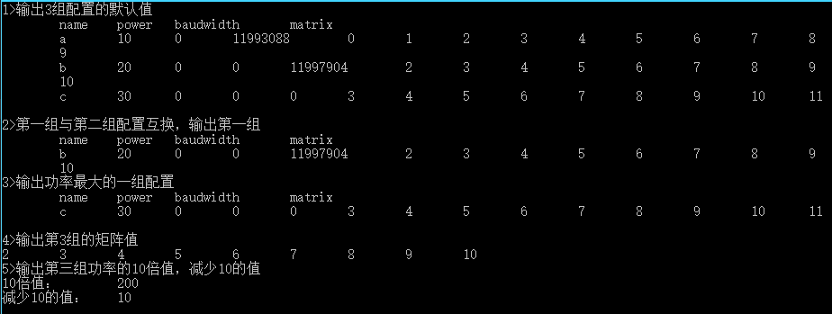

##作业提交
####代码结构
```
int ConfigureGenerate(configure group[], int n);
int ConfigureDisplay(configure group[], int n);
int ConfigureMatrixDisplay(configure *j);
int ConfigureExchange(configure *p, int x, int y);

int ConfigurePowerMax(configure *p, int n);
int ConfigurePowerMath(configure *p, char c, int n);
 L   int ConfigurePowerMultiply(configure *p, int n);
 L   int ConfigurePowerSubtraction(configure *p, int n);
```
####运行效果


####存在问题
```
因为枚举变量的特性问题，在输出效果上造成了一定的影响
```

####编译与调试过程
```
1.枚举变量的输出有问题

2.ConfigureExchange里开始定义temp指针没有赋初值，直接开始交换目标
的两个结构体，发生segmentation fault。一般都是非法内存操作，例如
1>数组越界
2>指针指向了非法内存，例如申明一个指针，但是没有对指针进行初始化，
直接就引用，或者引用里面的元素或者函数，或者没有分配内存就进行释放等，
另外，申请内存还要检查是否申请成功，如果没有申请成功也会出现这种情况

3.解决错误2导致了该错误，我解决错误2用的是直接把形参传给定义configure指针
的初值，但是这导致了交换完成后第一组配置的值被覆盖导致丢失，三组配置里有两
组一样
最后采用malloc来申请动态存储空间来存temp，解决了问题
```